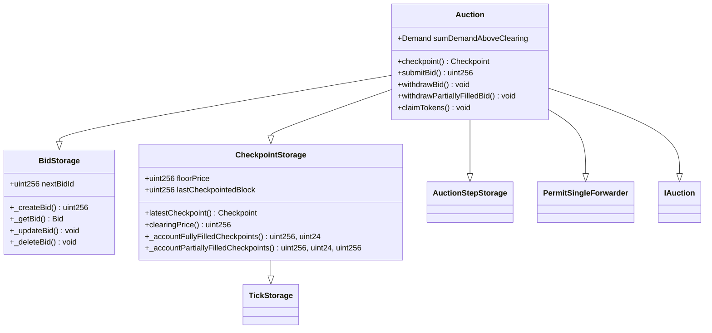
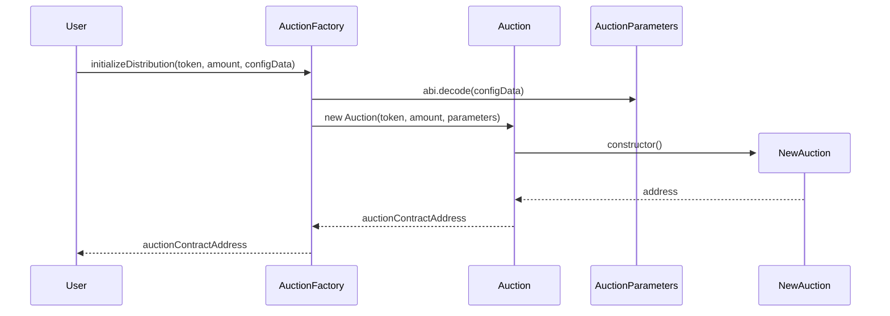
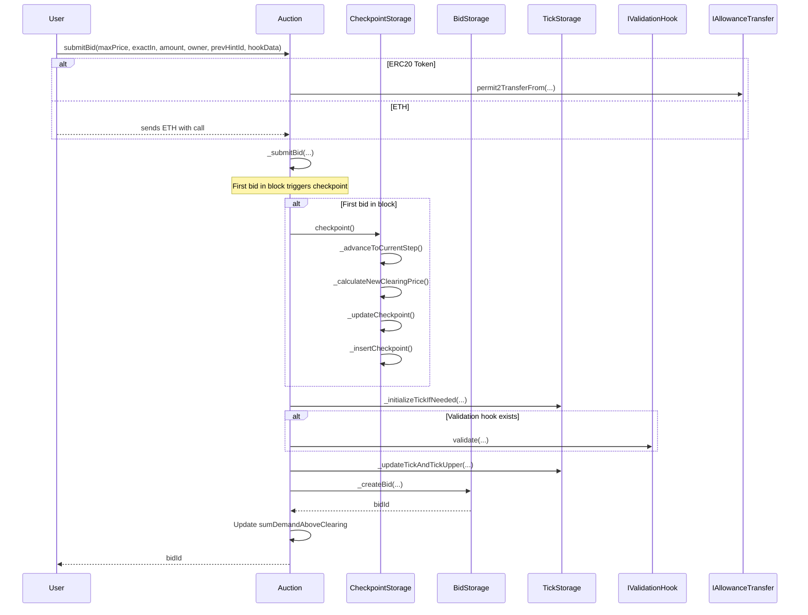
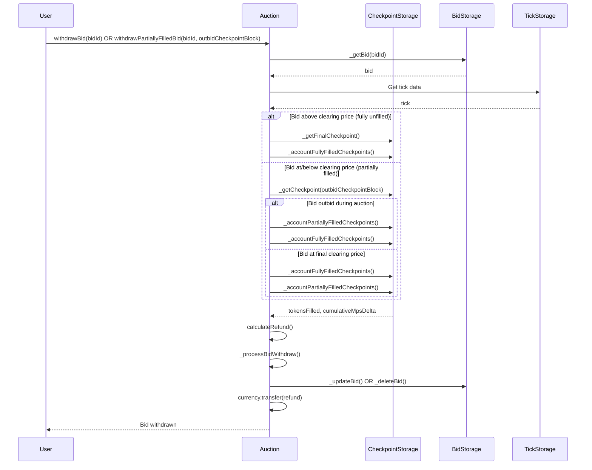
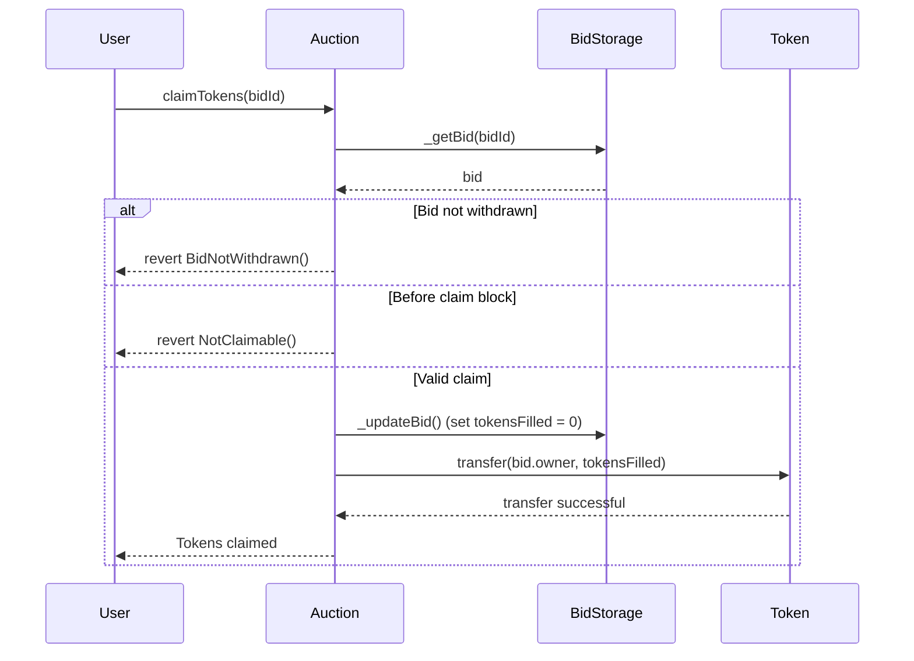
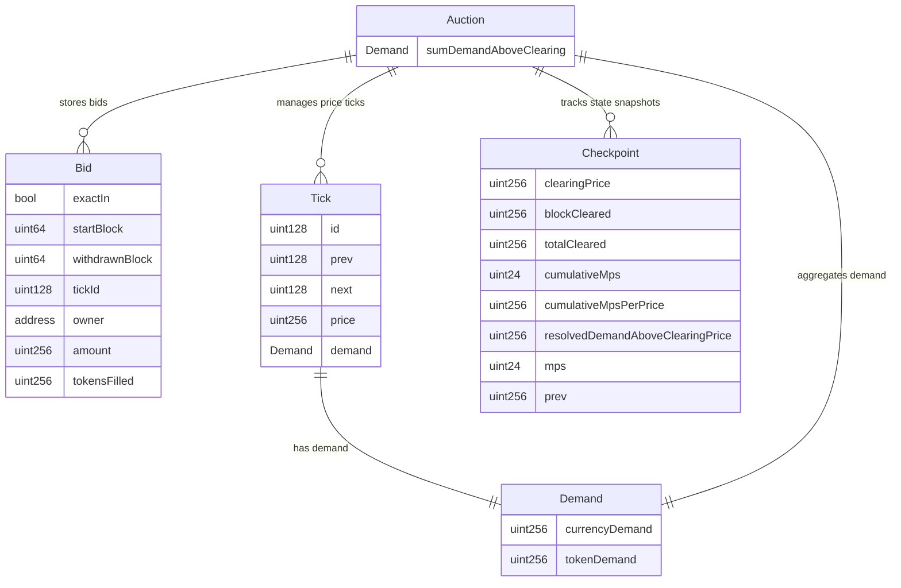

# TWAP Auction

This repository contains the smart contracts for a TWAP (Time-Weighted Average Price) auction mechanism.

## Installation

```bash
forge install
```

## Testing

```bash
forge test
```

### Architecture

```mermaid
graph TD;
    subgraph Contracts
        AuctionFactory;
        Auction;
        AuctionStepStorage;
        TickStorage;
        CheckpointStorage;
        BidStorage;
        PermitSingleForwarder;
    end

    subgraph Libraries
        AuctionStepLib;
        BidLib;
        CheckpointLib;
        DemandLib;
        TickLib;
        CurrencyLibrary;
        SSTORE2[solady/utils/SSTORE2];
        FixedPointMathLib[solady/utils/FixedPointMathLib];
        SafeTransferLib[solady/utils/SafeTransferLib];
    end

    subgraph Interfaces
        IAuction;
        IAuctionStepStorage;
        ITickStorage;
        IPermitSingleForwarder;
        IValidationHook;
        IDistributionContract;
        IDistributionStrategy;
        IERC20Minimal;
        IAllowanceTransfer[permit2/IAllowanceTransfer];
    end

    AuctionFactory -- creates --> Auction;
    AuctionFactory -- implements --> IDistributionStrategy;

    Auction -- inherits from --> BidStorage;
    Auction -- inherits from --> CheckpointStorage;
    Auction -- inherits from --> AuctionStepStorage;
    Auction -- inherits from --> PermitSingleForwarder;
    Auction -- implements --> IAuction;

    CheckpointStorage -- inherits from --> TickStorage;
    CheckpointStorage -- uses --> CheckpointLib;
    CheckpointStorage -- uses --> BidLib;
    CheckpointStorage -- uses --> TickLib;

    Auction -- uses --> AuctionStepLib;
    Auction -- uses --> BidLib;
    Auction -- uses --> CheckpointLib;
    Auction -- uses --> DemandLib;
    Auction -- uses --> TickLib;
    Auction -- uses --> CurrencyLibrary;
    Auction -- uses --> FixedPointMathLib;
    Auction -- uses --> SafeTransferLib;

    Auction -- interacts with --> IValidationHook;
    Auction -- interacts with --> IDistributionContract;
    Auction -- interacts with --> IERC20Minimal;
    Auction -- interacts with --> IAllowanceTransfer;

    AuctionStepStorage -- uses --> AuctionStepLib;
    AuctionStepStorage -- uses --> SSTORE2;
    AuctionStepStorage -- implements --> IAuctionStepStorage;

    TickStorage -- uses --> TickLib;
    TickStorage -- uses --> DemandLib;
    TickStorage -- implements --> ITickStorage;

    BidStorage -- uses --> BidLib;

    PermitSingleForwarder -- implements --> IPermitSingleForwarder;
    PermitSingleForwarder -- interacts with --> IAllowanceTransfer;
```



### Contract Inheritance for Auction.sol



### Auction Construction Flow



### Bid Submission Flow



### Bid Withdrawal Flow



### Token Claiming Flow



### Data Structure Relationships



### Checkpoint Process

```mermaid
flowchart TD
    A[checkpoint() called] --> B{First bid in block?}
    B -->|No| Z[Return existing checkpoint]
    B -->|Yes| C[Get latestCheckpoint]
    
    C --> D[_advanceToCurrentStep]
    D --> E{block.number >= step.endBlock?}
    E -->|Yes| F[Transform checkpoint with step MPS]
    F --> G[_advanceStep]
    G --> H[Update end block]
    H --> E
    E -->|No| I[Calculate blockTokenSupply]
    
    I --> J[Get sumDemandAboveClearing]
    J --> K[Start with tickUpper]
    K --> L{Demand >= blockTokenSupply?}
    L -->|Yes| M[Subtract tick demand]
    M --> N[Move to next tick]
    N --> O[Update tickUpperId]
    O --> L
    L -->|No| P[_calculateNewClearingPrice]
    
    P --> Q{Demand between ticks?}
    Q -->|Yes| R[Interpolate clearing price:<br/>currencyDemand * tickSpacing /<br/>(blockTokenSupply - tokenDemand)]
    Q -->|No| S[Use tickUpper.price]
    R --> T[Round down to tickSpacing]
    S --> T
    T --> U{Price < floorPrice?}
    U -->|Yes| V[Set to floorPrice]
    U -->|No| W[Keep calculated price]
    V --> X[_updateCheckpoint]
    W --> X
    
    X --> Y[_insertCheckpoint]
    Y --> AA[Emit CheckpointUpdated]
    AA --> Z
```

### Withdraw Bid Decision Flow

```mermaid
flowchart TD
    A[withdrawBid() or<br/>withdrawPartiallyFilledBid()] --> B[Get bid and tick data]
    B --> C{Auction ended?}
    C -->|No| D[revert CannotWithdrawBid]
    C -->|Yes| E{tick.price vs clearingPrice?}
    
    E -->|tick.price > clearingPrice| F[Fully Unfilled Bid]
    E -->|tick.price < clearingPrice| G[Outbid Bid]
    E -->|tick.price == clearingPrice| H[At Clearing Price]
    
    F --> I[Use _getFinalCheckpoint]
    I --> J[_accountFullyFilledCheckpoints<br/>Simple: tokensFilled = 0]
    J --> K[Calculate full refund]
    
    G --> L[Require outbidCheckpointBlock hint]
    L --> M[Validate checkpoint hint]
    M --> N[_accountPartiallyFilledCheckpoints<br/>Complex: iterate checkpoints]
    N --> O[_accountFullyFilledCheckpoints<br/>For remaining period]
    O --> P[Sum tokensFilled and mpsDelta]
    
    H --> Q[Validate checkpoint hints]
    Q --> R[_accountFullyFilledCheckpoints<br/>For fully filled period]
    R --> S[_accountPartiallyFilledCheckpoints<br/>For final partial period]
    S --> T[Sum partial + full fills]
    
    K --> U[_processBidWithdraw]
    P --> U
    T --> U
    U --> V[Update/delete bid storage]
    V --> W[Transfer refund]
    W --> X[Emit BidWithdrawn]
```

### Partial Fill Calculation Detail

```mermaid
flowchart TD
    A[_accountPartiallyFilledCheckpoints] --> B[Get bidDemand and tickDemand<br/>at tick price]
    B --> C[Start with upper checkpoint]
    C --> D{upper.prev != 0?}
    D -->|No| E[Return accumulated values]
    D -->|Yes| F[Get next checkpoint]
    
    F --> G{next.clearingPrice < tick.price?}
    G -->|Yes| H[Found boundary checkpoint]
    G -->|No| I[Calculate partial fill for period]
    
    H --> J[Calculate final period fill:<br/>bidDemand.calculatePartialFill()]
    J --> K[Add to totals and break]
    K --> E
    
    I --> L[Calculate fill for full period:<br/>supply = upper.totalCleared - next.totalCleared<br/>mpsDelta = upper.cumulativeMps - next.cumulativeMps]
    L --> M[bidDemand * supplySoldToTick / tickDemand]
    M --> N[Add to running totals]
    N --> O[Move to next checkpoint]
    O --> C
    
    E --> P[Return: tokensFilled, cumulativeMpsDelta, nextCheckpointBlock]
```

### Clearing Price Calculation Detail

```mermaid
flowchart TD
    A[_calculateNewClearingPrice] --> B[Resolve demand above clearing at tickUpper]
    B --> C[Apply MPS denominator scaling]
    C --> D{resolvedDemand == 0 OR<br/>resolvedDemand == blockTokenSupply?}
    D -->|Yes| E[Perfect match: return tickUpper.price]
    D -->|No| F[Partial match between ticks]
    
    F --> G[Get tickLower demand]
    G --> H[Add tickLower to sumDemand]
    H --> I[Apply MPS scaling to combined demand]
    I --> J[Calculate interpolated price:<br/>currencyDemand * tickSpacing /<br/>(blockTokenSupply - tokenDemand)]
    
    J --> K[Round down to tick boundary:<br/>price - (price % tickSpacing)]
    K --> L{price < floorPrice?}
    L -->|Yes| M[Return floorPrice]
    L -->|No| N[Return calculated price]
    
    E --> O[Final clearing price]
    M --> O
    N --> O
```
