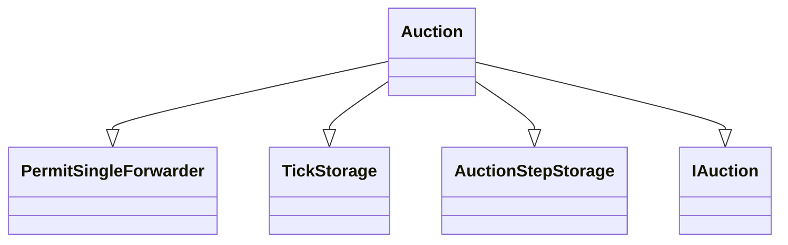
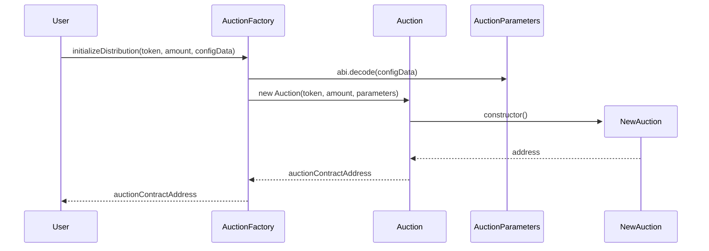
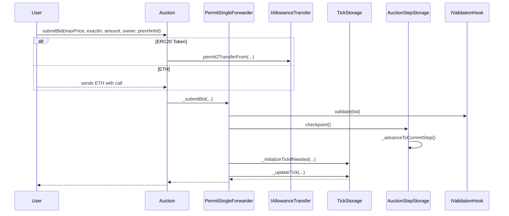
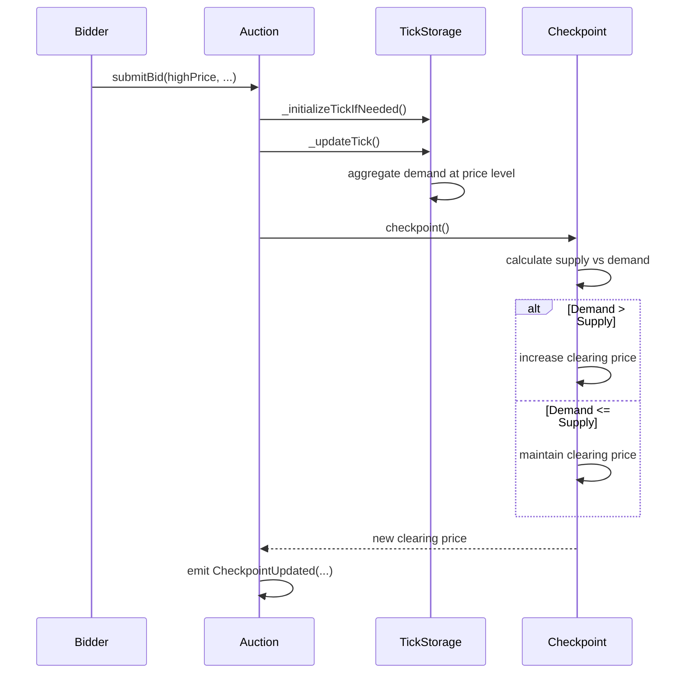

# TWAP Auction

This repository contains the smart contracts for a TWAP (Time-Weighted Average Price) auction mechanism.

## Installation

```bash
forge install
```

## Testing

```bash
forge test
```

## Architecture

```mermaid
graph TD;
    subgraph Contracts
        AuctionFactory;
        Auction;
        AuctionStepStorage;
        TickStorage;
        PermitSingleForwarder;
    end

    subgraph Libraries
        AuctionStepLib;
        BidLib;
        CurrencyLibrary;
        SSTORE2[solady/utils/SSTORE2];
        FixedPointMathLib[solady/utils/FixedPointMathLib];
        SafeTransferLib[solady/utils/SafeTransferLib];
    end

    subgraph Interfaces
        IAuction;
        IAuctionStepStorage;
        ITickStorage;
        IPermitSingleForwarder;
        IValidationHook;
        IDistributionContract;
        IDistributionStrategy;
        IERC20Minimal;
        IAllowanceTransfer[permit2/IAllowanceTransfer];
    end

    AuctionFactory -- creates --> Auction;
    AuctionFactory -- implements --> IDistributionStrategy;

    Auction -- inherits from --> PermitSingleForwarder;
    Auction -- inherits from --> TickStorage;
    Auction -- inherits from --> AuctionStepStorage;
    Auction -- implements --> IAuction;

    Auction -- uses --> AuctionStepLib;
    Auction -- uses --> BidLib;
    Auction -- uses --> CurrencyLibrary;
    Auction -- uses --> FixedPointMathLib;
    Auction -- uses --> SafeTransferLib;

    Auction -- interacts with --> IValidationHook;
    Auction -- interacts with --> IDistributionContract;
    Auction -- interacts with --> IERC20Minimal;
    Auction -- interacts with --> IAllowanceTransfer;

    AuctionStepStorage -- uses --> AuctionStepLib;
    AuctionStepStorage -- uses --> SSTORE2;
    AuctionStepStorage -- implements --> IAuctionStepStorage;

    TickStorage -- uses --> BidLib;
    TickStorage -- implements --> ITickStorage;

    PermitSingleForwarder -- implements --> IPermitSingleForwarder;
    PermitSingleForwarder -- interacts with --> IAllowanceTransfer;
```



## Contract Inheritance for Auction.sol



## Smart Contract Functions Documentation

### Auction Setup and Supply Curves

The auction and its supply curve are configured through the AuctionFactory which deploys individual Auction contracts with configurable parameters.

```solidity
interface IAuctionFactory {
    function initializeDistribution(
        address token,
        uint256 amount,
        bytes calldata configData
    ) external returns (address);
}
```

**Implementation**: The factory decodes `configData` into `AuctionParameters` containing the step function data (MPS schedule), price parameters, and timing configuration. The step function defines how many tokens are released per block over time.

### Validation Hooks

Optional validation hooks allow custom logic to be executed before bids are accepted, enabling features like allowlists, rate limiting, or complex validation rules.

```solidity
interface IValidationHook {
    function validate(Bid calldata bid) external view;
}
```

**Implementation**: If a validation hook is configured during auction deployment, it is called during `_submitBid()` and must not revert for the bid to be accepted.

### Bid Submission

Users can submit bids specifying either exact currency input or exact token output desired.

```solidity
interface IAuction {
    function submitBid(
        uint128 maxPrice,
        bool exactIn,
        uint256 amount,
        address owner,
        uint128 prevHintId
    ) external payable;
}
```

**Implementation**: Bids are validated, funds transferred via Permit2 (or ETH), ticks initialized if needed, and demand aggregated. Higher bids can increase the clearing price through supply-demand dynamics.

### Get current clearing price

The clearing price represents the current marginal price at which tokens are being sold.

```solidity
interface IAuction {
    function clearingPrice() external view returns (uint256);
}
```

**Implementation**: Returns the clearing price from the most recent checkpoint.

### Determine user allocation

Users can determine their token allocation by providing a bid id along with checkpoint information.

```solidity
interface IAuction {
    function claimTokens(uint256 bidId) external;
}
```

**Implementation**: Bids above the clearing price receive tokens proportional to time elapsed and MPS rate.

### Get auction timing and supply information

```solidity
interface IAuctionStepStorage {
    function step() external view returns (AuctionStep memory);
    function startBlock() external view returns (uint64);
    function endBlock() external view returns (uint64);
}

interface IAuction {
    function totalSupply() external view returns (uint256);
}
```

**Implementation**: Current step contains MPS (tokens per block), start/end blocks. Total supply is immutable.

## Flow Diagrams

### Auction Construction Flow



### Bid Submission Flow



### Price Discovery Flow



## Key Concepts

**MPS**: Represents the percentage of supply released per block, expressed in ten-millionths (1e7 = 100%).

**Tick-based Price Discovery**: Bids are organized by price levels (ticks) with enforced spacing. Clearing price moves between ticks.

**Exact-In vs Exact-Out**: Bidders can specify either exact currency input (exact-in) or exact token output desired (exact-out), with different settlement calculations.

**Checkpoints**: Snapshots of auction state (clearing price, cumulative cleared tokens, cumulative MPS) created when new bids potentially change the clearing price.